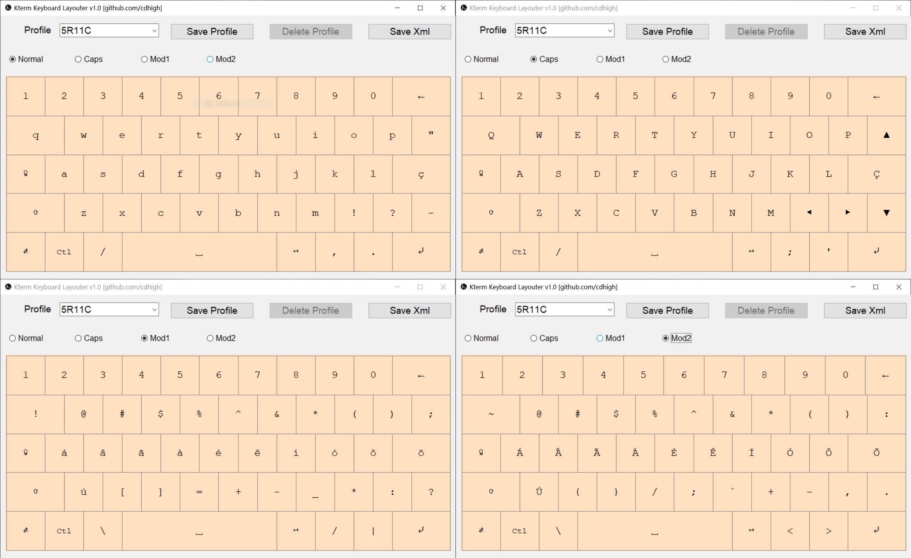
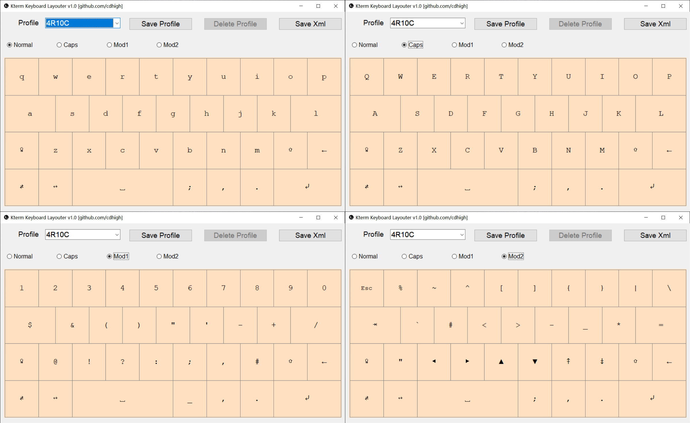
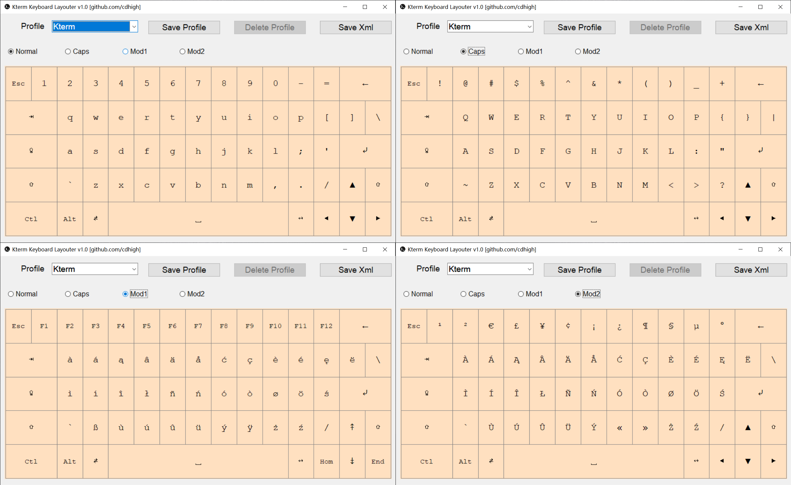
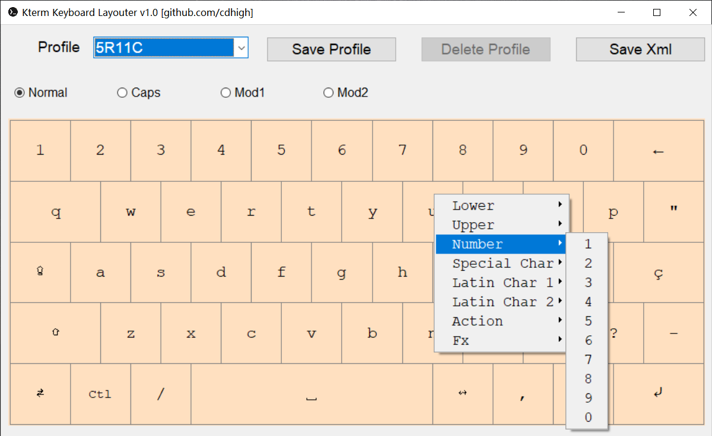

# Kterm keyboard layouter
This is a keyboard designer for [Kterm](https://github.com/bfabiszewski/kterm), allowing you to visually modify the keyboard layout.

# Requirements
* Python >= 3.8
* Using the built-in tkinter GUI library, no any third-party libraries required

# Screen shots

